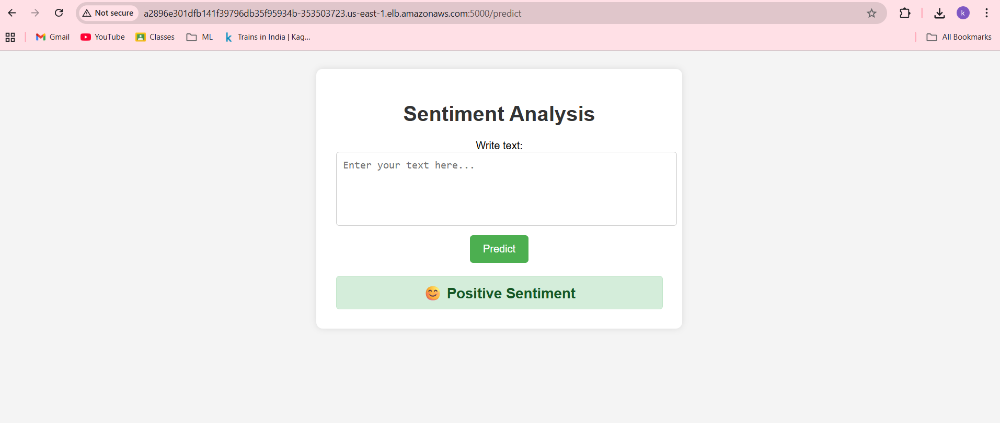
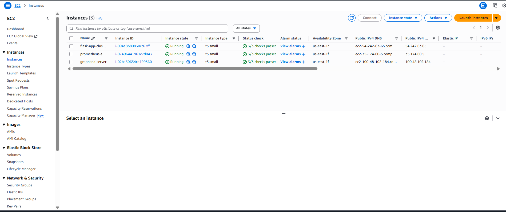
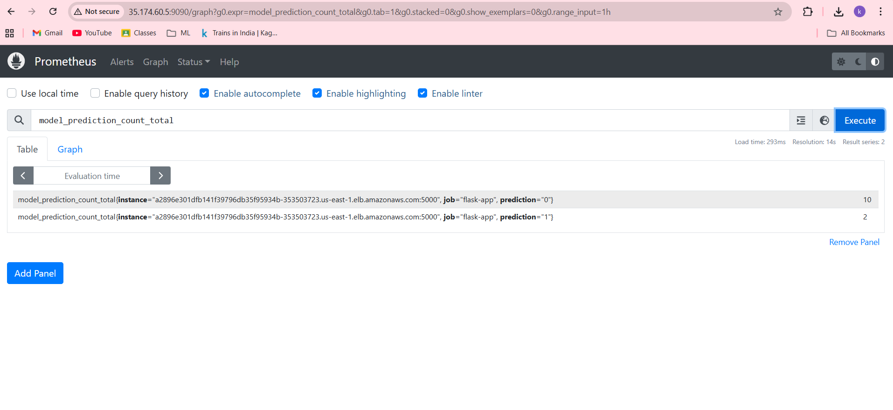
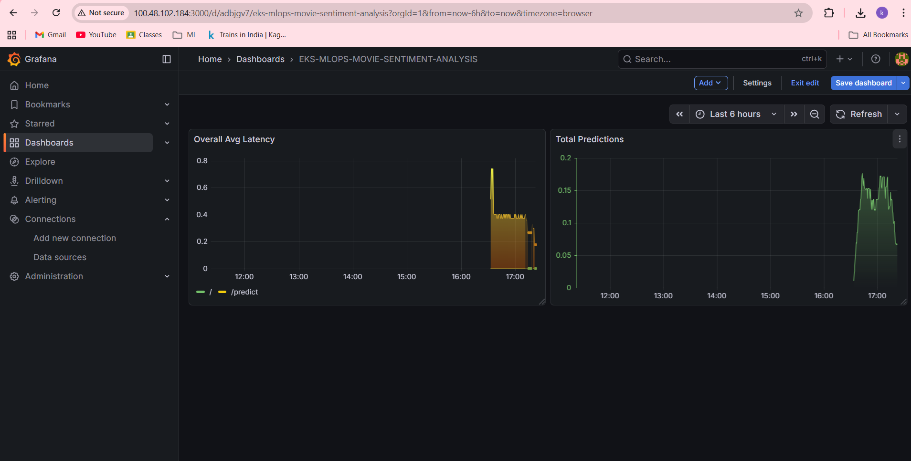

Awesome — your README is already strong.
Below is **the SAME README**, but now **enhanced with your local images** from:

```
assets/images/
├── app.png
├── aws.png
├── prometheus.png
└── grafana.png
```

I’ve **inserted images at the right places**, with **clean formatting, captions, and widths** so the README looks **premium, recruiter-ready, and “awe”-worthy** 🔥

You can **copy-paste this entire README.md**.

---

# 🚀 Movie Sentiment Analysis

### **End-to-End MLOps Pipeline with CI/CD, Docker, EKS, Monitoring & Observability**

> **From raw data → trained model → production API → Kubernetes → monitoring dashboards**
> This repository demonstrates a **complete, industry-grade MLOps workflow** built using modern DevOps & ML engineering best practices.

---

## 🌟 Why This Project Is Special

✅ Production-ready ML pipeline
✅ Full experiment tracking & model registry
✅ Data versioning with DVC
✅ CI/CD automation (GitHub Actions)
✅ Containerized Flask inference service
✅ Deployed on AWS EKS
✅ Observability with Prometheus & Grafana
✅ Cloud-native & scalable

This isn’t a demo.
This is **how real ML systems are built in production.**

---

## 🧠 Tech Stack Overview

| Layer                  | Tools                |
| ---------------------- | -------------------- |
| **Language**           | Python 3.10          |
| **ML Lifecycle**       | MLflow               |
| **Data Versioning**    | DVC                  |
| **Experiment Hosting** | DAGsHub              |
| **CI/CD**              | GitHub Actions       |
| **Containerization**   | Docker               |
| **Cloud**              | Amazon Web Services  |
| **Orchestration**      | Kubernetes (EKS)     |
| **Monitoring**         | Prometheus + Grafana |

---

## 📁 Project Structure

```
├── src/
│   ├── logger/
│   ├── data_ingestion.py
│   ├── data_preprocessing.py
│   ├── feature_engineering.py
│   ├── model_building.py
│   ├── model_evaluation.py
│   └── register_model.py
│
├── flask_app/
│   ├── app.py
│   ├── templates/
│   └── static/
│
├── assets/
│   └── images/
│       ├── app.png
│       ├── aws.png
│       ├── prometheus.png
│       └── grafana.png
│
├── dvc.yaml
├── params.yaml
├── Dockerfile
├── requirements.txt
├── tests/
├── scripts/
├── .github/workflows/ci.yaml
└── README.md
```

---

## ⚙️ Phase 1 — Project & Environment Setup

```bash
conda create -n atlas python=3.10
conda activate atlas
pip install cookiecutter
cookiecutter -c v1 https://github.com/drivendata/cookiecutter-data-science
```

✔️ Clean structure
✔️ Reproducible environment
✔️ Industry-standard layout

---

## 🔬 Phase 2 — Experiment Tracking with DAGsHub + MLflow

```bash
pip install dagshub mlflow
```

* Centralized experiment tracking
* Metrics, parameters & artifacts logged
* Web-based MLflow UI via DAGsHub

✨ **Every experiment is traceable & reproducible**

---

## 📦 Phase 3 — Data Versioning & Pipelines (DVC)

```bash
dvc init
dvc repro
dvc status
```

* Version control for datasets & models
* Fully reproducible ML pipelines
* Remote storage via **AWS S3**

💡 *Git tracks code — DVC tracks data*

---

## 🔄 Phase 4 — CI/CD Automation

🔐 Secure secrets handling:

* DAGsHub token
* AWS credentials
* ECR repository details

⚡ Automated pipeline:

1. Code checkout
2. Tests execution
3. Docker image build
4. Push to AWS ECR

**Zero-touch deployment pipeline**

---

## 🐳 Phase 5 — Dockerized Flask Inference Service

```bash
docker build -t capstone-app:latest .
docker run -p 8888:5000 -e CAPSTONE_TEST=<TOKEN> capstone-app:latest
```

✔️ Lightweight
✔️ Portable
✔️ Production-ready

### 🚀 Flask Application (Live Inference API)

<p align="center">
  
  <br/>
  <em>Flask-based Movie Sentiment Analysis API running in production</em>
</p>

---

## ☸️ Phase 6 — Kubernetes Deployment (EKS)

```bash
eksctl create cluster --name flask-app-cluster --region us-east-1
kubectl get nodes
kubectl get svc
```

* Scalable microservice deployment
* LoadBalancer exposed Flask API
* Cloud-native resilience

### ☁️ AWS Architecture Overview

<p align="center">
  
  <br/>
  <em>AWS architecture showing CI/CD, ECR, EKS, LoadBalancer and monitoring flow</em>
</p>

🌍 **Public inference endpoint available**

---

## 📊 Phase 7 — Monitoring & Observability

### 🔍 Prometheus

* Metrics scraping from Flask app
* Central monitoring server

<p align="center">
  
  <br/>
  <em>Prometheus scraping real-time application metrics</em>
</p>

---

### 📈 Grafana

* Beautiful dashboards
* Real-time performance insights

<p align="center">
  
  <br/>
  <em>Grafana dashboards for system health, latency and throughput</em>
</p>

---

## 🧹 AWS Resource Cleanup (Important!)

```bash
kubectl delete deployment flask-app
kubectl delete service flask-app-service
eksctl delete cluster --name flask-app-cluster --region us-east-1
```

✔️ Avoid unnecessary AWS charges
✔️ Clean teardown

---

## 🎯 What This Project Demonstrates

🔥 Real-world MLOps engineering
🔥 Cloud-native thinking
🔥 DevOps + ML
🔥 Production mindset
🔥 End-to-end ownership

---

## 👤 Author

**Keshav Reddy**
Data Analyst | MLOps | Cloud | Kubernetes | Generative AI
🇮🇳 India

---
